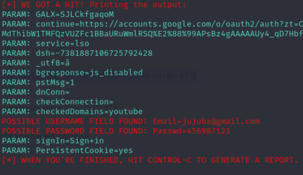

# Phishing para captura de senhas do Facebook
- Este desafio de projeto faz parte do conteúdo abordado pelo Santander Bootcamp Cibersegurança, realizado pela DIO em parceria com o Santander.

### Ferramentas

- Kali Linux
- setoolkit

### Configurando o Phishing no Kali Linux

- Acesso root: ``` sudo su ```
- Iniciando o setoolkit: ``` setoolkit ```
- Tipo de ataque: ``` Social-Engineering Attacks ```
- Vetor de ataque: ``` Web Site Attack Vectors ```
- Método de ataque: ```Credential Harvester Attack Method ```
- Método de ataque: ``` Web Templates ```
- Obtendo o endereço da máquina: ``` ifconfig ```
- Web Templates: ``` Google ```

### Resultados




### Obs:
Não consegui realizar o desafio com a url do ``` Facebbok ``` via ``` Site Cloner ```, por isso fiz um caminho alternativo.
